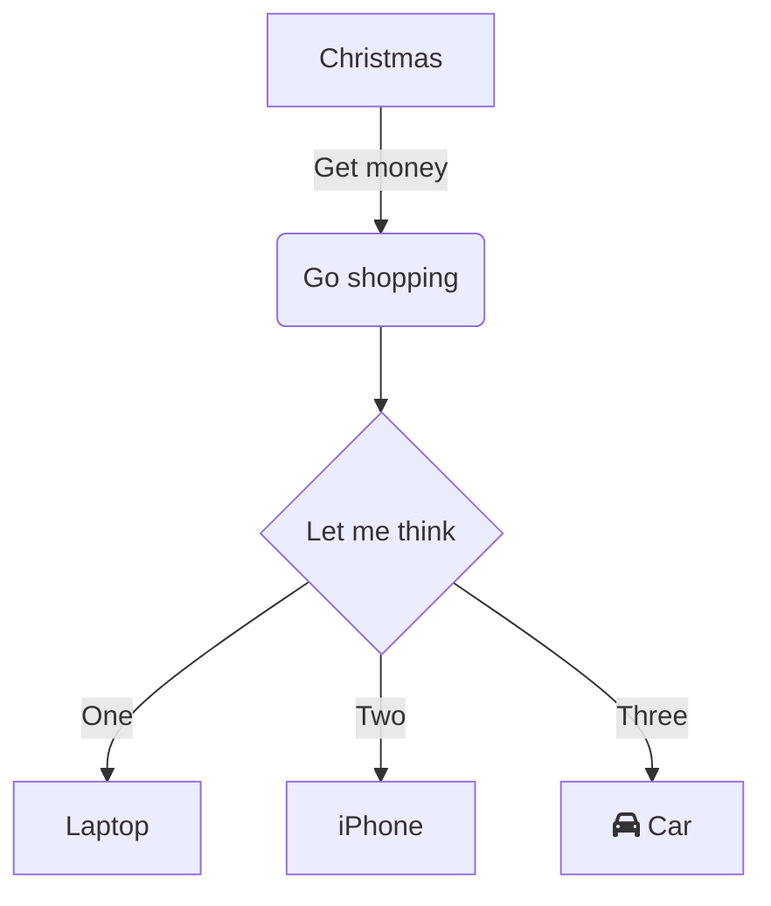

Have you ever started working on a new project, started going through the documentation and you realize that the architecture diagrams or sequence diagrams are out of date.

I've certainly seen this situation arise numerous times in my career so far. So what do you do? One solution would be whoever's reading the document needs to do the work to figure out the updated architecture or flows and generate the new diagrams using . This isn't ideal and these are bound to get stale again in the future.

Another solution which I prefer is - maintaining diagrams as code which live in the same repos as the code. There are many tools these days which help us author diagrams from code.
My favorites are [Mermaid](https://github.com/mermaid-js/mermaid) and [PlantUML](https://plantuml.com/).
Now your code can live in the repo and evolve along with the codebase. You might need to do additional setup if you'd like the diagrams to be generated as part of your CI/CD.
I like to maintain these in a `/docs` folder within the project repo.

An example of how the code would look like in mermaid and it's output are below:

Code:

Output:

Bonus: Mermaid.js has built in support in GitHub for markdown files. You won't need to do anything special to generate diagrams here.

That's it, what's your take on these? Do you know any tools which offer better options or more customisation? Leave a comment :smile: !

---
